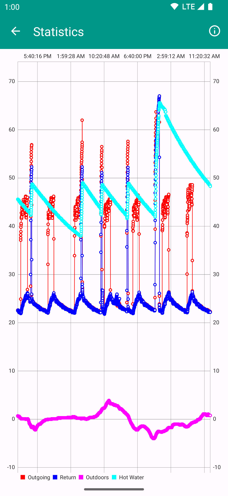

# Heat Pump Display

Display temperature and status of heat pump, heating and hot water of heat pumps controlled
by the Alpha-InnoTec Luxtronik 2.0 controller.

| Display screen                                  | Statistics screen                                     |
|-------------------------------------------------|-------------------------------------------------------|
|  |  |

Pull requests against `main` welcome.

See `docs` folder for useful information.

## Installation

### Google Play

[Download on Google Play](https://play.google.com/store/apps/details?id=com.uwetrottmann.wpdisplay)

### GitHub

The Android Package (APK) for each production release is attached to its associated
[GitHub release](https://github.com/UweTrottmann/wp-display-android/releases/latest).

However, I **recommend to use an update manager app** to ensure the latest updates are installed
automatically or you are notified about new updates. For example:

### Obtainium

[Install with Obtainium](https://apps.obtainium.imranr.dev/redirect.html?r=obtainium://add/https://github.com/UweTrottmann/wp-display-android)

Or manually add it using the following URL:

```text
https://github.com/UweTrottmann/wp-display-android
```

## License

Except where noted otherwise, this work by [Uwe Trottmann](https://www.uwetrottmann.com) is licensed under the [Apache License 2.0](LICENSE.txt).

Code [contributors](https://github.com/UweTrottmann/wp-display-android/graphs/contributors) and changes are tracked by Git.
