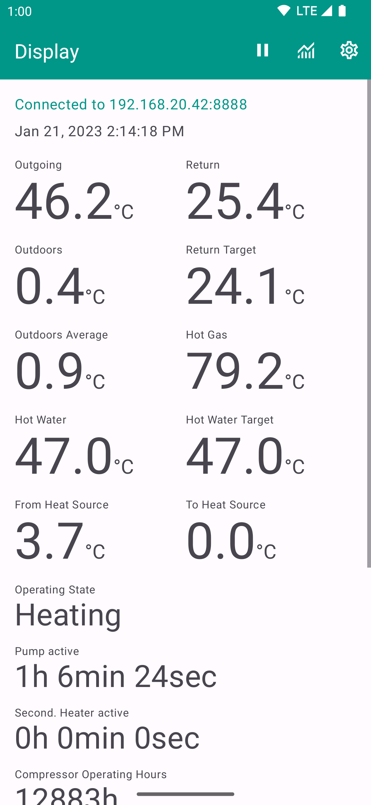

# wp-display-android
Display temperature and status of heat pump, heating and hot water of heat pumps controlled
by the Alpha-InnoTec Luxtronik 2.0 controller.

[Download on Google Play][1].

I also wrote a [Chrome app][2] doing the same thing. 

Pull requests against `master` welcome.

License
-------

    Copyright 2015 Uwe Trottmann

    Licensed under the Apache License, Version 2.0 (the "License");
    you may not use this file except in compliance with the License.
    You may obtain a copy of the License at

       http://www.apache.org/licenses/LICENSE-2.0

    Unless required by applicable law or agreed to in writing, software
    distributed under the License is distributed on an "AS IS" BASIS,
    WITHOUT WARRANTIES OR CONDITIONS OF ANY KIND, either express or implied.
    See the License for the specific language governing permissions and
    limitations under the License.

[1]: https://play.google.com/store/apps/details?id=com.uwetrottmann.wpdisplay
[2]: https://github.com/UweTrottmann/wp-display
